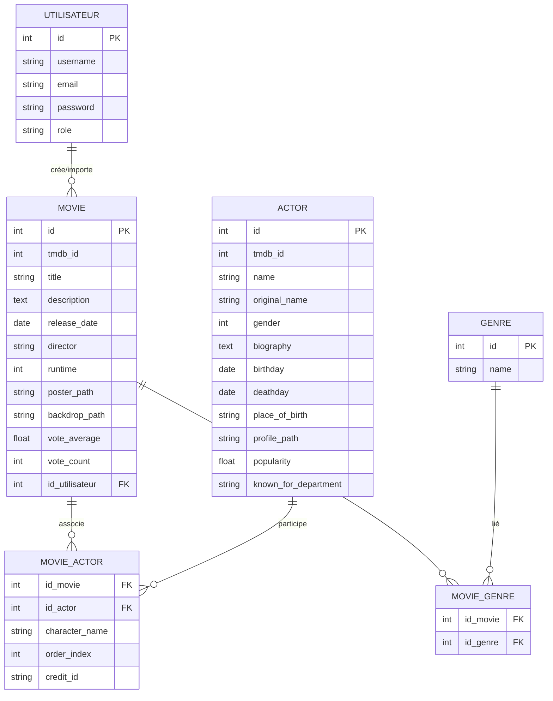
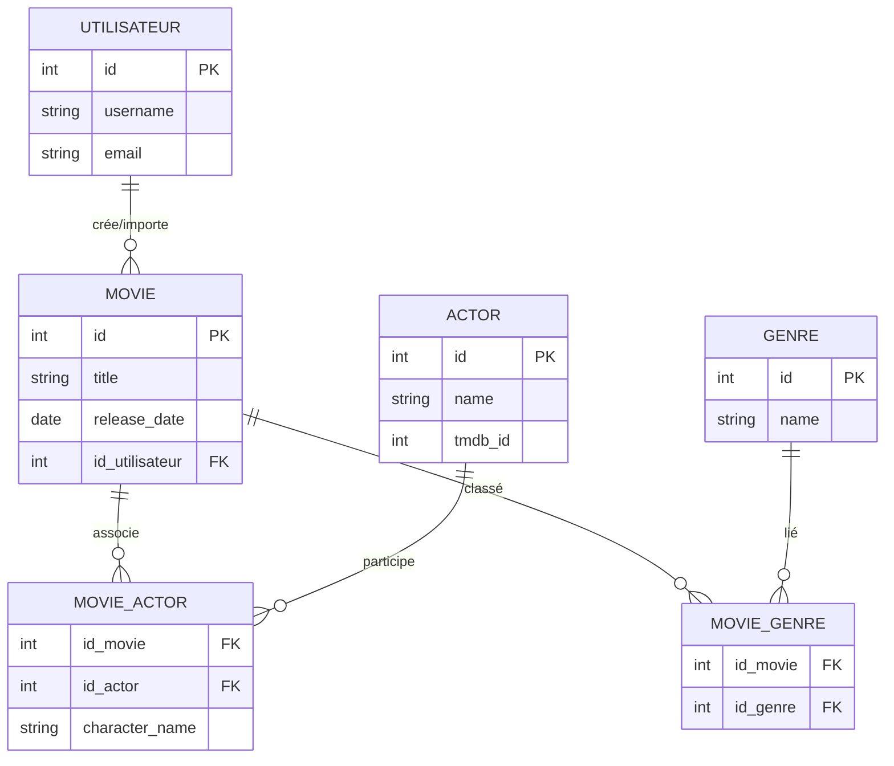

# CineVerse – Documentation technique de la base de données

## Contexte du projet

Ce document présente la conception de la base de données du projet **CineVerse**.  
L'objectif est de centraliser les informations sur les films, les acteurs et leurs genres dans un modèle relationnel clair, fiable et facile à étendre.

Cette phase concerne uniquement la modélisation :
- création du modèle conceptuel de données (MCD),
- définition du modèle logique de données (MLD),
- validation du schéma sur dbdiagram.io.

---

## Objectifs

- Identifier les entités principales : films, acteurs, genres et utilisateurs.  
- Définir les relations entre ces entités (1-N, N-N).  
- Prévoir les identifiants externes (`tmdb_id`, `imdb_id`) pour la future intégration avec l'API TMDb.  
- Fournir un modèle cohérent, compatible avec n'importe quel SGBD ou CMS (ex. Strapi, Symfony, etc.).

---

## Modèle conceptuel (MCD)

Le modèle repose sur quatre entités principales : **Movie**, **Actor**, **Genre** et **Utilisateur**,  
auxquelles s'ajoutent deux tables de liaison (**MovieActor** et **MovieGenre**) pour gérer les relations multiples entre films, acteurs et genres.

### Relations principales

/ Entités concernées    / Type de lien / Détail 

/ Utilisateur           / Movie         / 0 à N / Seuls les utilisateurs ayant le rôle `admin` peuvent créer 
                                                    ou importer des films.                 
                                                    Chaque film est lié à un seul utilisateur (admin), mais un utilisateur peut n'avoir aucun film. 
/ Movie                 / Actor         / N à N / Un film peut avoir plusieurs acteurs, 
                                                    et un acteur peut apparaître dans plusieurs films. 
/ Movie                 / Genre         / N à N / Un film peut appartenir à plusieurs genres 
                                                    (par exemple comédie, drame, etc.). 

---

## Modèle logique (MLD)

### Diagramme ER (Mermaid) — Version complète

### Diagramme ER (Mermaid) — Version simplifiée

## Définition des tables

### Types et énumérations

#### Type énuméré : `role_type`
| Valeur | Description |
|:-------|:------------|
| `admin` | Administrateur |
| `user` | Utilisateur standard |

---

### Table : `utilisateur`
> Gestion des utilisateurs et administrateurs du système

| Champ | Type | Description |
|:------|:-----|:------------|
| `id` | `int (PK)` | Identifiant unique |
| `username` | `varchar(100)` | Nom d'utilisateur |
| `email` | `varchar(150, unique)` | Adresse e-mail |
| `password` | `varchar(255)` | Mot de passe |
| `role` | `role_type` | Valeur autorisée : `admin` ou `user` |

---

### Table : `movie`
> Informations principales des films

| Champ | Type | Description |
|:------|:-----|:------------|
| `id` | `int (PK)` | Identifiant interne |
| `tmdb_id` | `int` | Identifiant du film sur TMDb |
| `title` | `varchar(255)` | Titre du film |
| `description` | `text` | Synopsis ou résumé |
| `release_date` | `date` | Date de sortie |
| `director` | `varchar(255)` | Réalisateur |
| `runtime` | `int` | Durée en minutes |
| `poster_path` | `varchar(255)` | Lien vers l'affiche |
| `backdrop_path` | `varchar(255)` | Lien vers le fond |
| `vote_average` | `float` | Note moyenne |
| `vote_count` | `int` | Nombre de votes |
| `id_utilisateur` | `int (FK → utilisateur.id)` | Référence à l'administrateur ayant ajouté le film |

---

### Table : `actor`
> Informations des acteurs et actrices

| Champ | Type | Description |
|:------|:-----|:------------|
| `id` | `int (PK)` | Identifiant interne |
| `tmdb_id` | `int` | Identifiant TMDb de l'acteur |
| `name` | `varchar(255)` | Nom de l'acteur |
| `original_name` | `varchar(255)` | Nom original |
| `gender` | `int` | 1 = femme, 2 = homme |
| `biography` | `text` | Biographie |
| `birthday` | `date` | Date de naissance |
| `deathday` | `date (nullable)` | Date de décès |
| `place_of_birth` | `varchar(255)` | Lieu de naissance |
| `profile_path` | `varchar(255)` | Photo de profil |
| `popularity` | `float` | Popularité |
| `known_for_department` | `varchar(255)` | Département artistique |
| `imdb_id` | `varchar(50)` | Identifiant IMDb |

---

### Table : `genre`
> Classification des genres cinématographiques

| Champ | Type | Description |
|:------|:-----|:------------|
| `id` | `int (PK)` | Identifiant du genre |
| `name` | `varchar(100)` | Nom du genre |

---

### Tables de liaison

#### Table : `movie_actor`
> Association films ↔ acteurs avec informations de casting

| Champ | Type | Description |
|:------|:-----|:------------|
| `id_movie` | `int (FK → movie.id)` | Film concerné |
| `id_actor` | `int (FK → actor.id)` | Acteur concerné |
| `character_name` | `varchar(255)` | Nom du personnage |
| `order_index` | `int` | Ordre d'apparition |
| `credit_id` | `varchar(50)` | Identifiant du crédit TMDb |

> **Clé primaire composée :** `id_movie + id_actor`

#### Table : `movie_genre`
> Association films ↔ genres

| Champ | Type | Description |
|:------|:-----|:------------|
| `id_movie` | `int (FK → movie.id)` | Film concerné |
| `id_genre` | `int (FK → genre.id)` | Genre concerné |

> **Clé primaire composée :** `id_movie + id_genre`

---

## Relations globales

| Association | Type | Description |
|--------------|------|-------------|
| utilisateur (1,N) → movie (0,1) | Chaque film est associé à un seul administrateur |
| movie (0,N) ↔ actor (0,N) | Films et acteurs |
| movie (0,N) ↔ genre (0,N) | Films et genres |

---

## Validation du schéma

Le modèle a été testé et validé sur **dbdiagram.io** :
- 6 tables principales,
- relations correctes entre les entités,
- clés primaires et étrangères fonctionnelles,
- structure compatible avec SQL et Strapi.

Aucune anomalie ni conflit détecté.

---

## Résumé

Ce modèle constitue la base de données du projet CineVerse.  
Il permet de gérer les informations liées aux films, aux acteurs, aux genres et aux utilisateurs.  
Seuls les administrateurs sont autorisés à ajouter ou importer des films, afin d'assurer la cohérence et la fiabilité des données.

Le schéma est volontairement simple et modulable, pour faciliter son évolution ou son intégration dans un CMS ou une API.

---

## Évolutions possibles

- Ajouter une table "Collection" pour gérer les sagas ou séries de films.
- Ajouter un système de favoris, de notes ou de commentaires par utilisateur.

